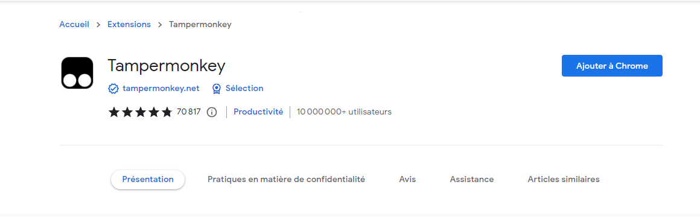
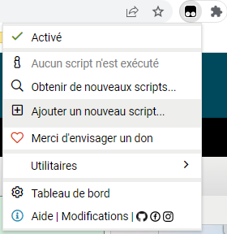
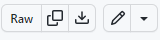
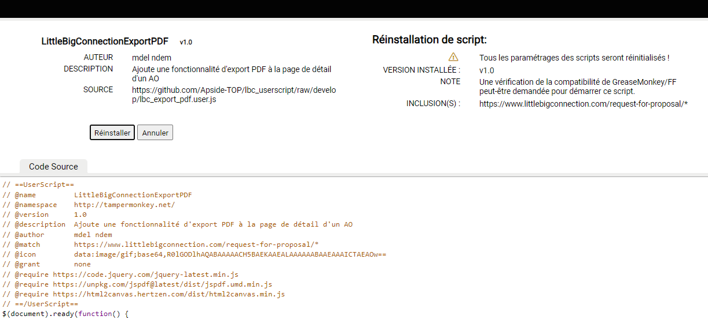
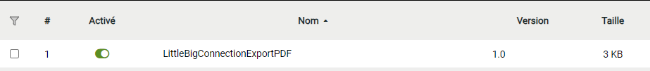
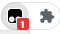
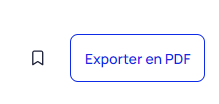
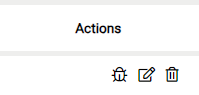
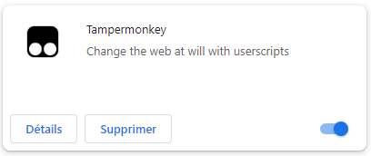

# Guide d'utilisation de Tampermonkey

Tampermonkey est une extension de navigateur qui vous permet d'ajouter et d'exécuter des scripts personnalisés pour personnaliser votre expérience de navigation. Suivez ces étapes pour l'installer et utiliser un script avec Tampermonkey.

## Étape 1 : Installation de Tampermonkey

1. Ouvrez votre navigateur web (par exemple, Google Chrome, Mozilla Firefox, ou Microsoft Edge).

2. Accédez à la page d'extension du navigateur :
   - [Tampermonkey pour Google Chrome](https://chrome.google.com/webstore/detail/tampermonkey/dhdgffkkebhmkfjojejmpbldmpobfkfo)
   - [Tampermonkey pour Mozilla Firefox](https://addons.mozilla.org/en-US/firefox/addon/tampermonkey/)
   - [Tampermonkey pour Microsoft Edge](https://microsoftedge.microsoft.com/addons/detail/tampermonkey/iikmkjmpaadaobahmlepeloendndfphd)

3. Cliquez sur le bouton "Ajouter à [nom du navigateur]" pour installer l'extension.

4. Une fois l'installation terminée, vous verrez l'icône Tampermonkey dans la barre d'outils de votre navigateur.

## Étape 2 : Utilisation d'un script

Maintenant que Tampermonkey est installé, vous pouvez utiliser le script personnalisé ***lbc_export_pdf.user.js***

Voici comment faire :

1. Trouvez le script ***lbc_export_pdf.user.js*** dans [le repository github](https://github.com/Apside-TOP/lbc_userscript/blob/develop/lbc_export_pdf.user.js).

2. Cliquez sur le lien "view raw".

3. Une fenêtre Tampermonkey apparaîtra, montrant le code du script. Cliquez sur "Installer" pour ajouter le script.

4. Le script est maintenant actif. Vous pouvez le voir dans le tableau de bord du plugin.

et au niveau de l'icone du plugin quand vous êtes sur la page ou se déclenche le script.

5. Rechargez ou ouvrez une nouvelle page web sur le detail d'un AO pour voir le script en action.

Ou

Télécharger le script (Download raw file) [***lbc_export_pdf.user.js***](https://github.com/Apside-TOP/lbc_userscript/blob/develop/lbc_export_pdf.user.js) et glisser déposer le fichier dans le tableau de bord de Tampermonkey.

C'est tout ! Vous avez installé et utilisé un script pour personnaliser votre expérience de navigation.

>***N'oubliez pas d'utiliser des scripts provenant de sources fiables et de comprendre leur fonctionnement avant de les installer pour des raisons de sécurité.***

# Désactivation/Activation/Suppression du script ou de Tampermonkey

Allez sur la page du tableau de bord du plugin pour désactiver/activer/supprimer le script que vous souhaitez.

Pour supprimer le plugin, allez dans la page paramétres > Extensions de Chrome.

